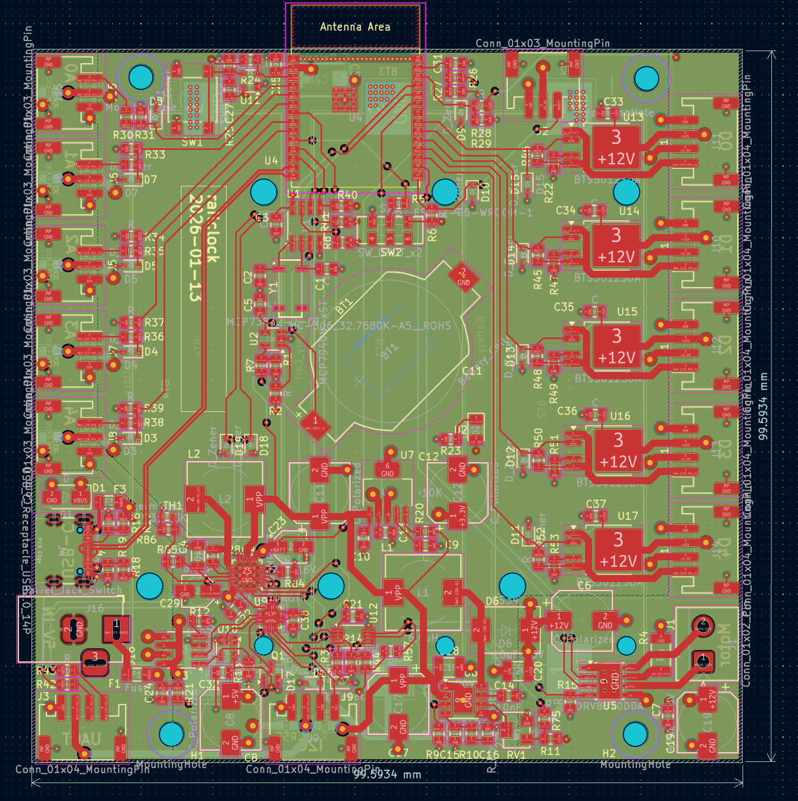

# ESP32 Mainboard (Railclock-derived)

> A general-purpose ESP32-C6 module mainboard originally created for the Railclock project and redesigned as a generic controller and motor-power board.

This PCB exposes 11 GPIOs via JST connectors for sensors and actuators. It can run without an external 5V supply by using an on-board battery charger and a boost converter to create a 12V rail for motors and higher-power peripherals.

## Key Features

- 11 accessible GPIOs on JST connectors (5 ADC-capable ports on the left, 5 digital/drive outputs on the right).
- Left side ports: ADC-capable pins and a selectable 5V supply (powered by on-board 5V regulator/charger when available).
- Right side ports: digitally-driven output stage able to source up to 12V and ~800 mA (per port design limits depend on load and thermal conditions).
- On-board power management:
  - BQ24296M battery charger to accept battery power and produce the 5V line when no external USB is present.
  - PAM2421 boost converter to generate the 12V rail from the battery/5V bus.
- Motor driver: DRV8870 used to drive DC motors from the 12V rail.
- RTC clock MCP7940n with separate battery.

## Hardware Overview

- Connectors:
  - Left JST ports: ADC-capable pins. Expect up to 5V on these when the 5V supply is enabled — do not exceed 5V on ADC inputs.
  - Right JST ports: digital outputs with high-side/outstage to provide up to 12V for actuators.
- Power flow:
  - Primary charge/power management by the BQ24296M allows operation from a Li-ion battery without external 5V.
  - The PAM2421 boost converter takes the available rail and creates the 12V bus used by the outputs and motor driver.
- Motor driver:
  - DRV8870 drives DC motors using the 12V rail; follow the datasheet for current-limiting and heat-sinking requirements.

## Firmware

Firmware for this board is written in Rust and maintained in a separate repository: https://github.com/L0czek/esp32-mainboard
